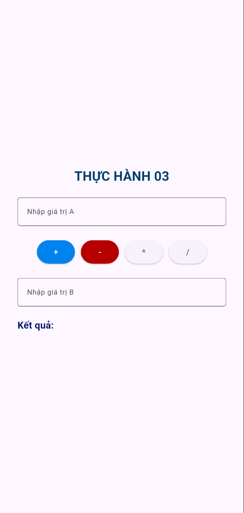
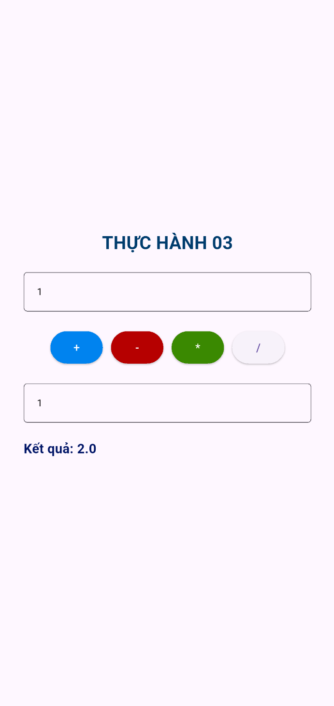
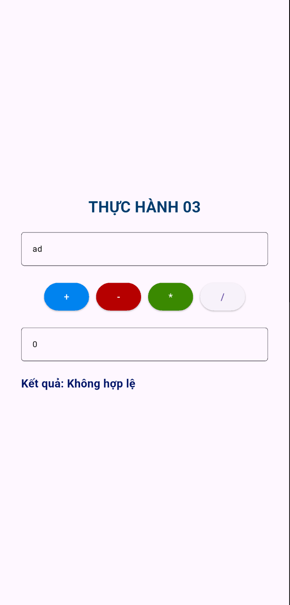

# **Mô Tả**

Bài tập 2 yêu cầu sinh viên tạo 1 giao diện đơn giản cho phép người dùng có thể nhập 2 giá trị a và b, có thể chọn phép tính và được hiện kết quả.

# **Các Hàm Chính**

**Main:** khởi tạo flutter
**MyApp.build:** cấu hình theme và thiết lập NumberList
**createList:** đọc số nguyên từ TextField, kiểm tra hợp lệ, hiển thị lỗi, tạo danh sách từ 1 đến n.
**\_NumberListState.build():** TextField để nhập số, nút "Tạo" để tạo createList().

# **Kết Quả**

**Giao diện:**
    
**Nhập đúng cứu biểu thức cộng:**
    
**Nhập đúng cứu biểu thức trừ:**
    
**Nhập đúng cứu biểu thức nhân:**
    
**Nhập đúng cứu biểu thức chia:**
    
**Nhập sai cứu pháp:**
    
**Điều kiện chia:**
    