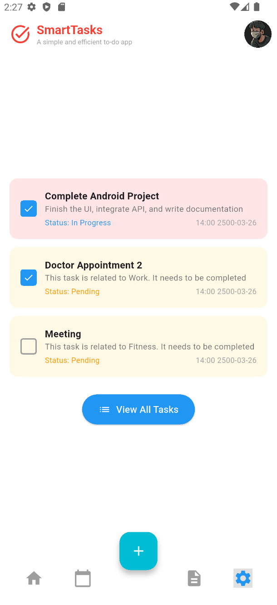
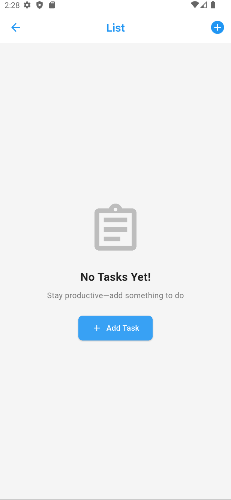
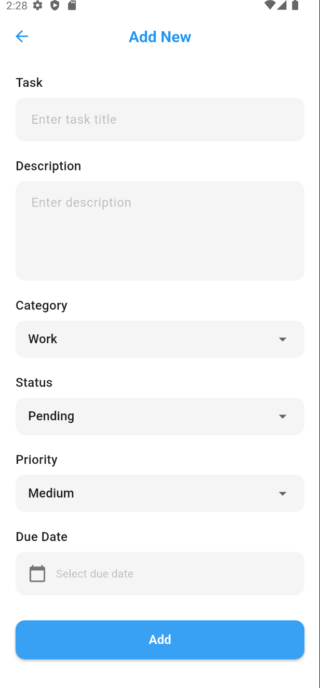

# SMART TASK

Ứng dụng quản lý công việc thông minh với tính năng **Data Flow Navigation** cho giao diện quên mật khẩu và đặt lại mật khẩu mới.

  

## Link GitHub

[https://github.com/trieuhoang1212/BaiTap-Mobile/tree/main/Tuan4/SmartTask](https://github.com/trieuhoang1212/BaiTap-Mobile/tree/main/Tuan4/SmartTask)

---

## Tính năng chính

- Giao diện quên mật khẩu
- Xác thực email
- Nhập mã OTP 4 số
- Đặt lại mật khẩu mới
- Data Flow Navigation giữa các màn hình

---

# **Kết Quả**

## **Giao diện chính:**

  

---

## **Luồng Quên Mật Khẩu:**

### Giao diện nhập email để gửi mã

  

### 2️⃣ Giao diện nhập mã OTP với 4 số

  

### Giao diện nhập và xác thực mật khẩu mới

  

### Giao diện hoàn tất đổi mật khẩu thành công

  

---

## **Giao diện Task List:**

  
  &nbsp;&nbsp;&nbsp;
  

## **Giao diện Profile:**

  
  
## 🛠️ Công nghệ sử dụng

- **Flutter** - Framework phát triển ứng dụng đa nền tảng
- **Dart** - Ngôn ngữ lập trình
- **Material Design** - Thiết kế giao diện
